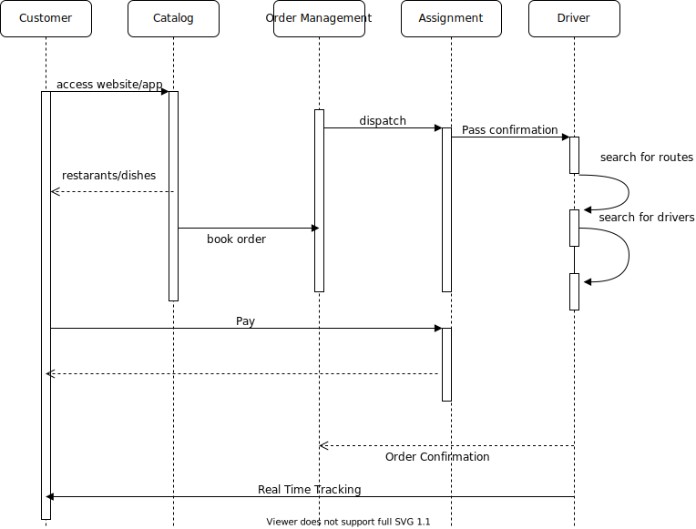

# Design and Implementation
The Design and Implementation stage of the first iteration consists of implementing the basic “foundation” that will likely be immutable for the duration of the project, and is the highest-important action item for delivery of the MVP. With regards to those specifications, the following items were assigned highest priority for the first iteration:
1. Design of customer login page:
   1. For the first iteration, the sign-up feature is not required.
   2. The user should be able to log in with a unique name and password.
   3. The system should be able to identify if the user has input either of the login credentials incorrectly, and prompt the user to try again.

2. Design of the login page (for restaurant order manager):
   1.The restaurant order manager should be able to have a unique login page that traces all incoming orders (placed in a queue)
   1. As the queue management system has not been designed yet, the restaurant order manager can log into a unique blank screen.

3. Preliminary UI for restaurant selection.
   1.The user should be able to view a selection of restaurants that have partnered with the application. 
   1. In the event that the number of restaurants does not fit on the screen, the user should be able to scroll through to view additional restaurants. 
   2. For the first iteration, no special filtering/sorting of restaurants on location, dietary restrictions, or cuisine is required.

# Low Level Components 
1. Services implementation/identification
   1. Restaurants Discovery - Nearby restaurants based on location/pincode
      1. Categorization of restaurants
      2. Tags on restaurants
      3. Filter based on cuisines
   2. User Management Service -  login, account creation/deletion),
   3. Payment Service - native/outsource - based on decision taken in system modelling
   4. Order Management Service - Receive Customer order / give status of 
      1. Pickup
      2. Delivery
   5. Restaurants Portal/Interface - Show orders to restaurants 
   6. Delivery Mapping Service - Map order to drivers
   7. Tracking Service - for customer to track order
2. Algo implementation (Djiksta, A*, whatever)
   1. Constrained optimization problem - identify the shortest amount of time that each delivery driver needs to travel to 

# Design and Implementation Activtiy
## Diagrams

### Use-case diagram
WIP

### Sequence Diagram

# Algorithm Design
The task of our restaurant-vehicle-destination system is to take in food orders, restaurants, and drivers, and calculate the average time-to-delivery with option to vary number of drivers and number of restaurants.

Constraints: Our inputs are O orders, R restaurants, and D drivers. Each driver D, can have 0 to O number of orders assigned to them. Logically, we would presume that the number of orders is spread out almost evenly among the drivers. Each driver D takes some time, t, to deliver 1 order. An order has an associated restaurant, time placed, time delivered, driver, and zipcode to deliver to. A restaurant has X amount of orders placed to it, and has an associated zipcode. A driver has an origin point and can be assigned orders to deliver.

Inputs: # of drivers, # of restaurants, # of orders

Problem: minimize the delivery time for each order.

Outputs: average time-to-delivery

## Algorithm process:
1. Intialize a graph made up of the restaurants and drivers as nodes with edges being travel time.
2. Perform Dijkstra's algorithm on the graph to find the smallest routes between drivers and restaurants.
3. Intialize a new graph of restaurants and delivery destinations as nodes with edges being travel time.
4. Perform Dijkstra's algorithm on the graph to find the smallest routes between restaurants and delivery destinations.
5. Do a greedy approach and match drivers to the restaurants that they are closest to.
6. Then, evenly distribute the orders among the drivers, choosing orders that are closest to each other to assign to a single driver by performing a modified version of Dijkstra's with order destinations as the only nodes and finding localized orders.
7. Compute the average time calculated by adding the smallest route between driver and restaurant and smallest route between restaurant and order.