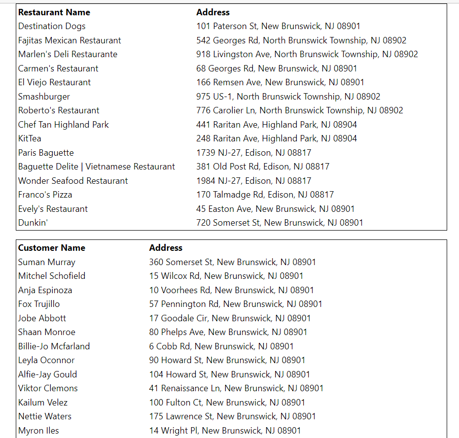
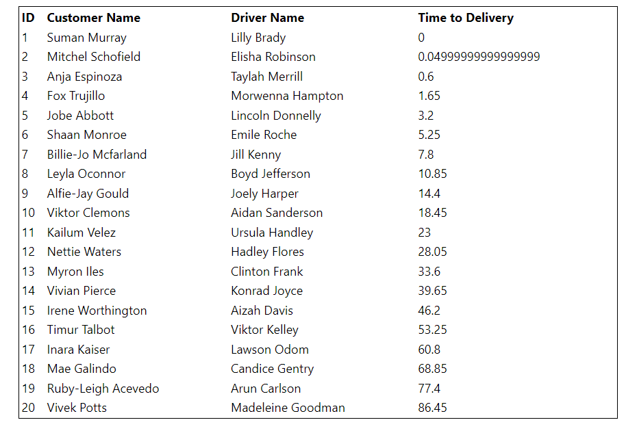

# User Interface

## Screenshots of the user interface

The UI interface shows the restaurants that have been partenered with, the customers with orders, and the drivers that have been partnered with as shown:

The UI will show each order's estimated time to delivery for more insight into where bottlenecks might be.
At the very bottom, FreshFood will clearly be able to view their average time to delivery, as well as the parameters they have selected for number of restaurants, drivers, etc.

## Running the front end
Running the front end application is as simple as downloading Node.js and npm, running npm i to install dependencies, and running the interface using the "npm start" script.

## Testing the front end
Because the front end is a simple way to view, the main aspects of testing would realy in component and system testing during development. This is because the components of the front-end would have to manage the APIs to communicate with the backend server and database.

Designed tests would be very similar to the interface testing done in the back-end stage because similar API requests will be used to interface between the front and back ends.